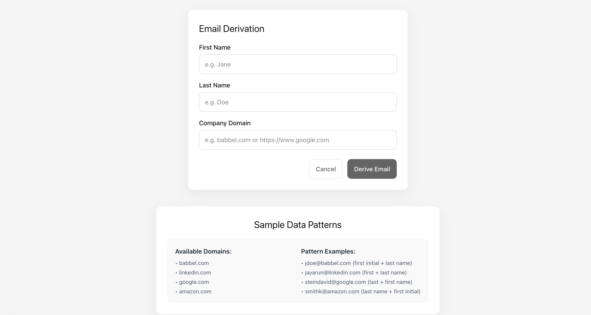

## Email Derivation

### Description
A Next.js App Router application that derives likely email addresses based on a company’s naming pattern. Users enter first name, last name and company domain; the app normalizes the domain, validates input with Zod (client + server), calls a Next.js API route, and shows the result in a modal. Includes component, hook, schema and API tests with Vitest.

If anyone want see this code, [please click at this link]([https://reddit-clone-lake-zeta.vercel.app/](https://email-derivation.vercel.app)).

### Features
- **Form-driven derivation**: First name, last name, company domain
- **Validation**: React Hook Form + Zod (client) & Zod (server)
- **Domain normalization**: Extracts/cleans domains from URLs (e.g., `https://www.google.com` → `google.com`)
- **Result modal**: Success/error displayed in a popup, stable layout
- **Sample data panel**: Static “Sample Data Patterns” section separate from the form
- **Tested**: Vitest + React Testing Library + jest-dom
- **Styling**: CSS Modules

### Technologies Used
- **Next.js 15** (App Router), **React 19**
- **React Hook Form**, **Zod**
- **Vitest**, **@testing-library/react**, **@testing-library/jest-dom**
- **CSS Modules**

### Getting Started

#### 1) Clone the repo and enter the app folder
```bash
git clone <your-repo-url>
cd babbel/email-derivation
```

#### 2) Install dependencies
```bash
npm install
```

#### 3) Run the dev server
```bash
npm run dev
```
Open: `http://localhost:3000`

No environment variables are required for this app.

### API
- `POST /api/derive-email`
  - Body: `{ firstName: string, lastName: string, domain: string }`
  - Response: `{ derivedEmail: string | null, message: string }`
- `GET /api/health`
  - Response: `{ status: 'healthy', timestamp: string }`

### Testing
Run the full test suite:
```bash
npm run test:run
```
Start interactive UI:
```bash
npm run test:ui
```
Coverage:
```bash
npm run test:coverage
```

### Linting
```bash
npm run lint        # report only
npm run lint:fix    # attempt fixes
```

### Scripts
```bash
npm run dev
npm run build
npm run start
npm run lint
npm run lint:fix
npm run test
npm run test:ui
npm run test:run
npm run test:coverage
```

### Example Pic

